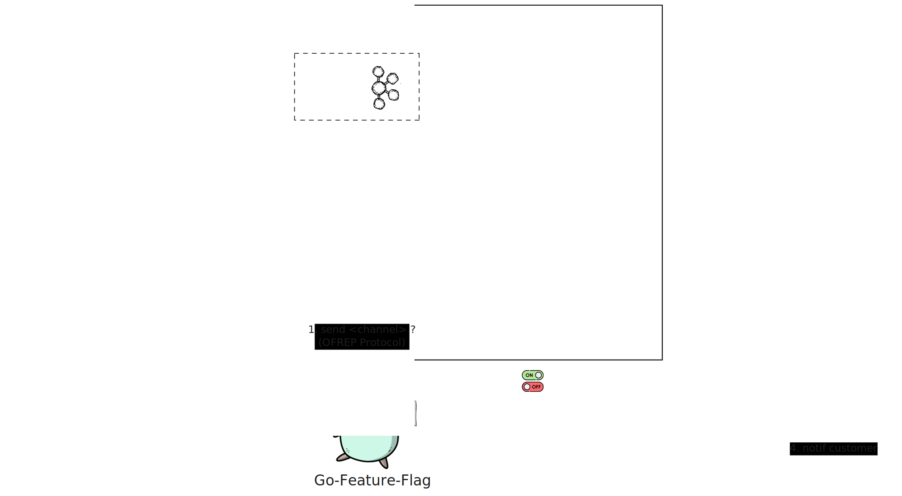

# notify-service-api 📢

## Késako ? 🧐
Microservice responsible for notifying (SMTP and SMS) the customers of an e-commerce company.

The consumers of this service are the company's other microservices

## Architecture 📐

> ℹ️ All external dependencies on the microservice are simulated via Docker Compose (it is launched when the Dev environment is started) to facilitate local development.

## Start the project 🚀

## Containerise the application 🐳

### Dokerfile-based

Containerisation of a JVM application comes up against a number of challenges :

- [**Resource allocation**](demos/resources-allocation) : You can play with [all the tasks](demos/resources-allocation/tasks.yml) and observe the subtleties
  - *Example : `task res-alloc:0-show-oomkiller`*
- [**Image cache/layers management**](demos/caching)
- [**Size of OCI images**](demos/sizing/)
- [**Maintaining operational condition**](demos/mco/)

### Dockerfile alternatives

There are [alternatives to Dockerfile](demos/alt-dockerfiles/tasks.yml), mainly based on the Source To Images strategy (Dockerfileless):

- [Cloud Native Buildpacks][cnb-doc]
- [Jib][jib-gh]

### Security Concerns

Just as vulnerabilities can exist in our application libraries, they can also be present in our images, particularly base images. It is essential to manage all our software dependencies and actively monitor their associated vulnerabilities.

We therefore need to adopt a [strategy for managing and analysing dependencies](demos/security/tasks.yml)

<!-- Links -->
[cnb-doc]: https://buildpacks.io/
[jib-gh]: https://github.com/GoogleContainerTools/jib
